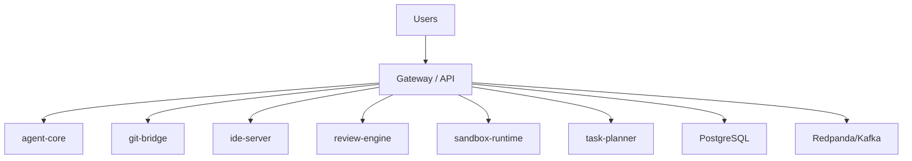

# ERP-Autonomous-Coding Architecture

## C4 Context
- Module: `ERP-Autonomous-Coding`
- Mode: standalone_plus_suite
- Auth: ERP-IAM (OIDC/JWT)
- Entitlements: ERP-Platform

## Container View

## Service Inventory
- `agent-core`
- `git-bridge`
- `ide-server`
- `review-engine`
- `sandbox-runtime`
- `task-planner`
